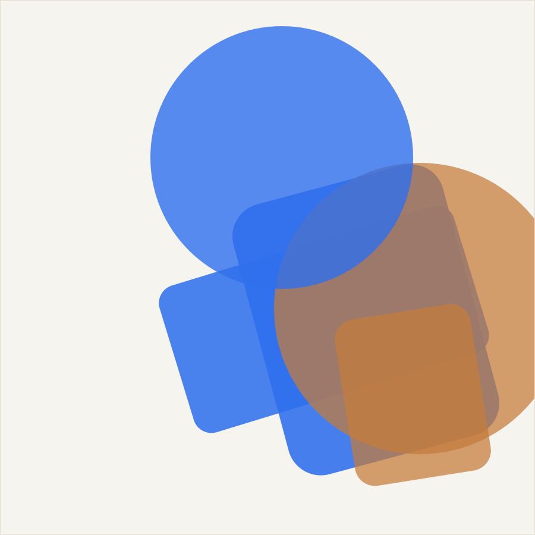

# bento-grid

Portfolioraster met benoemde tegelmaten (`data-tegel="groot|breed|hoog|
klein"`), zoals Chris' Werk-sectie: 2 grote tegels plus een blok van 4
kleine. Vaste beeldverhoudingen, een hele tegel klikbaar via precies 1
stretched-link, en responsief zonder gaten op desktop, tablet én mobiel.

## Wanneer wel

- Een portfolio-, projecten- of "meer nieuws"-raster met een paar
  uitgelichte items en een aantal kleinere.
- Wanneer je exact wilt sturen welke tegel groot/breed/hoog/klein is, in
  plaats van een algoritme dat dat automatisch bepaalt.

## Wanneer niet

- Voor een homogeen raster waarin elk item even groot is — dat is een
  gewone CSS-grid met `repeat(auto-fit, minmax(...))`, geen bento nodig.
- Niet voor een oneindig scrollende feed — bento werkt het best met een
  vaste, kleine set items per sectie (6–10).

## Installatie

```
component-library/layouts/bento-grid/
├── bento-grid.js       # vanilla ES-module: markup-contract-controle, 0 dependencies
├── bento-grid.css      # de eigenlijke layout + interactie (pure CSS)
├── BentoGrid.tsx        # React/Next.js client-wrapper
├── assets/              # eigen, procedureel gegenereerde SVG-tegelbeelden
├── demo.html             # zelfstandige demo (Studio Wester)
└── test/meet.mjs         # Playwright-meting
```

**Vanilla / elk framework**

```html
<div class="bento" data-bento-grid>
  <article class="tegel" data-tegel="groot">
    <div class="tegel__media"></div>
    <div class="tegel__tekst">
      <p class="tegel__titel"><a class="tegel__link" href="/projecten/appartement-noord">Appartement Noord</a></p>
      <p class="tegel__subtitel">Amsterdam · volledige verbouwing</p>
    </div>
  </article>
  <!-- … meer tegels, zie "Markup-contract" voor de volgorde … -->
</div>

<link rel="stylesheet" href="./bento-grid.css" />
<script type="module">
  import { init } from './bento-grid.js';
  init(document.querySelector('[data-bento-grid]'));
</script>
```

**React / Next.js (App Router)**

```tsx
import { BentoGrid } from '@/component-library/layouts/bento-grid/BentoGrid';

<BentoGrid>
  <article className="tegel" data-tegel="groot">
    <div className="tegel__media"></div>
    <div className="tegel__tekst">
      <p className="tegel__titel"><a className="tegel__link" href="/projecten/appartement-noord">Appartement Noord</a></p>
      <p className="tegel__subtitel">Amsterdam · volledige verbouwing</p>
    </div>
  </article>
</BentoGrid>
```

**WordPress**

Geen build-stap nodig. Zet de map in je thema, enqueue `bento-grid.css`
(`bento-grid.js` is optioneel — zie "Waarom een JS-bestand" hieronder), en
zet de tegel-markup in een Custom HTML-blok of template-part.

## Markup-contract

- `.bento` (of `[data-bento-grid]`) — de grid-container.
- Elke tegel: `<article class="tegel" data-tegel="groot|breed|hoog|klein">`
  met daarin:
  - `.tegel__media > img` — de vaste-beeldverhouding-afbeelding
    (`object-fit: cover`, de aspect-ratio komt van de vaste hoogte van het
    grid-vak, niet van het beeld zelf).
  - `.tegel__tekst > .tegel__titel > a.tegel__link` — **precies 1**
    stretched-link per tegel (`.tegel__link::after{position:absolute;
    inset:0}` maakt de hele tegel klikbaar, de zichtbare tekst blijft de
    titel). Voeg geen tweede interactief element toe binnen een tegel — de
    stretched-link overlapt dat.
  - `.tegel__subtitel` — optionele ondertitel, niet klikbaar.
- **Volgorde bepaalt de vulling.** De CSS gebruikt gewone (niet "dense")
  grid-auto-flow: de tegels vullen rij voor rij, in de volgorde waarin ze
  in de HTML staan. Om een gatenloos raster te krijgen zoals in de demo:
  - Blok "2 groot + 4 klein" (Chris' patroon): eerst de 2 `groot`-tegels
    (elk 2 kolommen × 2 rijen, samen vullen ze de eerste 2 rijen precies),
    dan de 4 `klein`-tegels (elk 1×1, vullen samen de 3e rij op een grid
    van 4 kolommen).
  - Blok met alle vier de maten: eerst `breed` (4 kolommen × 1 rij, de hele
    rij), dan `hoog` (1 kolom × 2 rijen) direct gevolgd door de
    `klein`-tegels die de resterende kolommen naast `hoog` opvullen.
  - Andere combinaties kunnen gaten geven als de spans niet precies een
    rij vol maken — controleer dat met `test/meet.mjs`'s
    oppervlakte-vergelijking (zie "Toegankelijkheid" hieronder voor wat er
    verder gemeten wordt) of visueel in de browser.

## Opties (`init(root, opties)`), met standaardwaarden

| Optie | Standaard | Omschrijving |
|---|---|---|
| `tegelSelector` | `"[data-tegel]"` | CSS-selector voor de tegels binnen `root`. |
| `linkSelector` | `".tegel__link"` | CSS-selector (binnen elke tegel) voor de stretched-link. |

CSS-variabelen/aanpaspunten (op `.bento` / `.tegel[data-tegel]`):

| Selector | Eigenschap | Standaard |
|---|---|---|
| `.bento` | `grid-template-columns` | `repeat(4, 1fr)` (desktop), `repeat(2, 1fr)` (≤60rem), `1fr` (≤30rem) |
| `.bento` | `grid-auto-rows` | `11rem` |
| `.tegel__media img` | zoom bij hover/focus | `scale(1.02)` |

## Waarom een JS-bestand, als de layout pure CSS is?

De layout, de hover/focus-zoom én de focusring om de hele tegel zijn met
opzet **pure CSS** — grid-auto-flow met attribute-selectors voor de layout,
en `:has(.tegel__link:focus-visible)` (alle evergreen browsers sinds
2022/2023) voor de zoom + ring. Dat betekent dat alles **ook zonder
JavaScript werkt** (R4/R14): een tegel is een gewone link, met een gewone
focus-outline zodra `:has()` niet ondersteund wordt
(`@supports not selector(:has(a))`-terugval in de CSS).

`bento-grid.js` voegt daarom geen gedrag toe. `init()` controleert in de
console (development-only nut) of het markup-contract klopt: precies 1
`.tegel__link` per tegel, en een bekende `data-tegel`-waarde — in dezelfde
geest als `vereisRoot` elders in deze bibliotheek (R5: waarschuwen, niet
crashen). `destroy()` bestaat voor een consistent contract met de andere
features in deze bibliotheek en doet verder niets (er is niets aan de DOM
toegevoegd om op te ruimen).

## Toegankelijkheid

- Elke tegel is met Tab bereikbaar via precies 1 link; Enter activeert hem
  zoals elke link.
- De focusring omvat de **hele tegel** (niet alleen de titeltekst) via
  `:has(.tegel__link:focus-visible)`, met een terugval naar een gewone
  link-outline als de browser `:has()` niet kent.
- De hover-zoom (`scale(1.02)`) gebeurt ook bij toetsenbordfocus
  (`:focus-visible`), niet alleen bij muis-hover.
- `prefers-reduced-motion: reduce` zet de zoom-transitie uit; het
  eindresultaat (uitvergroot of niet) blijft in beide gevallen leesbaar.
- Poster-``'s hebben een lege `alt=""` (decoratief; de tegel-titel
  draagt de betekenis) — vervang dat door een beschrijvende `alt` als het
  beeld zelf informatie draagt die niet in de titel staat.

## Op WordPress

Zie "Installatie" hierboven. Let op dezelfde caching-plugin-valkuil als bij
`reveal-on-scroll`: sluit `bento-grid.js` uit van JS-minificatie/-combinatie
als je het al gebruikt (het is optioneel, zie hierboven).

## Valkuilen

- **Een tweede link binnen een tegel** wordt onbereikbaar: de
  stretched-link (`.tegel__link::after`) ligt met `z-index: 1` over de
  hele tegel heen. Zet nooit een tweede klikbaar element in `.tegel__tekst`.
- **Spans die geen rij vol maken** geven een gat: bijvoorbeeld 3 losse
  `klein`-tegels op een 4-koloms-grid laat 1 cel leeg. Vul een rij altijd
  helemaal, of eindig bewust met een kortere laatste rij (dat is geen
  "gat", want er komt niets meer na).
  - Deze demo (2 blokken) is doorgerekend om exact te sluiten — zie
    "Markup-contract" hierboven voor de volgorde per blok.
- **`grid-column: span 2` op een 1-koloms mobiel-grid** zou een extra,
  impliciete kolom aanmaken en de pagina breder maken dan het scherm. De
  `@media (max-width: 30rem)`-regel overschrijft daarom élke `data-tegel`
  expliciet terug naar `span 1` — verwijder die regel niet.

## Herkomst

Layout gezien op christianbleeker.com: de Werk-sectie toont 2 grote projectkaarten
plus een blok van 4 kleine ("Meer projecten"), gebouwd met Tailwind-grid.
Wat wij beter doen: `breed`/`hoog` als generieke, herbruikbare tegelmaten
naast `groot`/`klein` (niet alleen dat ene vaste patroon), een echte
stretched-link met een focusring om de hele tegel (in plaats van alleen om
de titeltekst), en een expliciete mobiel-terugval die nooit een impliciete
extra kolom kan aanmaken. Eigen implementatie, geen code overgenomen.
