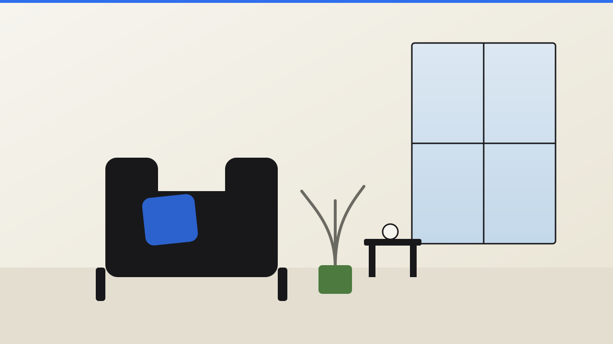

# video-facade

YouTube, Vimeo of Loom pas laden na een klik. Vóór de klik staat er alleen een eigen
posterafbeelding met een ronde ▶-knop — geen enkel verzoek naar YouTube,
`ytimg.com`, Vimeo of Loom. Pas na de klik komt de echte iframe erin
(`youtube-nocookie.com`, Vimeo met `dnt=1`, of Loom met de opschoon-parameters), met een vaste aspect-ratio
zodat er geen layout-shift is.

## Wanneer wel

- Elke ingesloten video verderop op de pagina (klantverhaal, productdemo,
  atelierrondleiding) waar snelheid en privacy vóór de klik belangrijker
  zijn dan meteen afspeelklare embeds.
- Sites die geen trackingcookies willen zetten vóórdat de bezoeker daar
  bewust voor kiest.

## Wanneer niet

- Voor een hero-achtergrondvideo die uit zichzelf al (gedempt) loopt — dat
  is `heroes/media-hero`, geen klik-facade.
- Niet voor een galerij van meerdere video's/foto's in een lightbox — dat is
  `media/flip-lightbox`.

## Installatie

```
component-library/media/video-facade/
├── video-facade.js       # vanilla ES-module, 0 dependencies
├── video-facade.css      # namespaced op .vf
├── VideoFacade.tsx        # React/Next.js client-wrapper
├── assets/                # eigen SVG-posters (geen stockfoto's), incl. standaardposter Loom
├── demo.html              # zelfstandige demo (Studio Wester)
└── test/meet.mjs          # Playwright-meting
```

**Vanilla / elk framework**

```html
<div class="vf" data-video-facade data-provider="youtube" data-id="dQw4w9WgXcQ" data-title="Klantverhaal">
  <a class="vf__fallback" data-vf-fallback href="https://www.youtube.com/watch?v=dQw4w9WgXcQ" aria-label="Video bekijken: Klantverhaal">
    
  </a>
</div>

<link rel="stylesheet" href="./video-facade.css" />
<script type="module">
  import { init } from './video-facade.js';
  const destroy = init(document.body); // zoekt zelf naar [data-video-facade]
</script>
```

**React / Next.js (App Router)**

```tsx
import { VideoFacade } from '@/component-library/media/video-facade/VideoFacade';

<VideoFacade>
  <div className="vf" data-video-facade data-provider="vimeo" data-id="76979871" data-title="Atelierrondleiding">
    <a className="vf__fallback" data-vf-fallback href="https://vimeo.com/76979871" aria-label="Video bekijken: Atelierrondleiding">
      
    </a>
  </div>
</VideoFacade>
```

**WordPress**

Zet de map in je thema, enqueue de CSS, laad `video-facade.js` als module
(zie `scroll/reveal-on-scroll`'s README voor het volledige
`wp_enqueue_script_module()`-recept) en plaats de blok-markup in een Custom
HTML-blok of template-part.

## Markup-contract

- `[data-video-facade]` — de wrapper (bepaalt de aspect-ratio via CSS).
  Attributen:
  - `data-provider` — `"youtube"` (standaard), `"vimeo"` of `"loom"`. Loom wordt ook
    zonder dit attribuut herkend als de fallback-link (of `data-id`) een
    `loom.com/share/<id>`- of `loom.com/embed/<id>`-URL is.
  - `data-id` — **verplicht**: het video-ID (YouTube: het deel na `v=`;
    Vimeo: het numerieke ID; Loom: het ID, of een volledige share-/embed-URL).
    Bij Loom mag `data-id` ontbreken: het ID komt dan uit de `href` van de
    fallback-link. Een Loom-ID met andere tekens dan letters/cijfers wordt
    overgeslagen (waarschuwing, geen knop).
  - `data-poster` — URL van een eigen poster; overschrijft de `` in de link.
    **Bij Loom effectief verplicht** (zie hieronder).
  - `data-title` — de titel, gebruikt in `aria-label` van de knop en als
    `title`-attribuut van de iframe.
  - `data-ytimg-poster` (optioneel, boolean) — gebruikt in plaats van de
    eigen `` de officiële YouTube-thumbnail (`i.ytimg.com/vi/<id>/
    hqdefault.jpg`). Dat is dan wél een derde-partij-request vóór de klik;
    laat dit attribuut weg voor een echt eigen poster (de standaard, en
    wat deze demo gebruikt).
- Binnenin: één `<a data-vf-fallback href="…">` met daarin de poster-``.
  Dit IS de volledige zonder-JS-ervaring (R4): een gewone link naar de
  video-pagina. Met JS neutraliseert `init()` deze link (`tabindex="-1"`,
  `aria-hidden="true"`) en voegt een echte `<button class="vf__play">` toe
  die de klik overneemt.
- Na een klik voegt de module een `<iframe class="vf__iframe">` toe en
  verbergt (`hidden`) de link en de knop.

## Loom

```html
<div class="vf" data-video-facade data-title="Zo werkt onze websitescan"
     data-poster="/posters/websitescan.jpg">
  <a class="vf__fallback" data-vf-fallback href="https://www.loom.com/share/<id>" aria-label="Video bekijken: Zo werkt onze websitescan">
    
  </a>
</div>
```

- **Embed-URL na de klik:** `https://www.loom.com/embed/<id>?autoplay=1&hide_owner=true&hide_share=true&hide_title=true&hideEmbedTopBar=true`.
  Een `?sid=…` uit de share-URL wordt niet doorgegeven.
- **Poster:** Loom heeft geen stabiele publieke thumbnail-URL, en een verzoek
  naar loom.com vóór de klik is precies wat deze facade voorkomt. Lever dus
  een eigen poster (screenshot van de opname) via `data-poster` of de ``
  in de link. Ontbreken beide, dan valt `init()` terug op
  `assets/poster-loom.svg` (een neutraal schermopname-venster). Zonder JS
  toont de markup alleen wat je zelf in de `` zet.
- **Autoplay:** `autoplay=1` is de parameter die Loom-embeds kennen, en de klik
  is een bewuste gebruikersactie in een iframe met `allow="autoplay"`, dus
  browsers laten het normaal toe. **Niet getest tegen echt loom.com** (de
  meting mockt alle Loom-verzoeken, bewust nooit een echte aanroep):
  controleer op de klantsite met een echte Loom-video dat hij na de klik zelf
  start en dat Loom `autoplay` niet in een specifieke workspace-instelling
  blokkeert.
- **Rommel verbergen:** `hide_owner`, `hide_share`, `hide_title` en
  `hideEmbedTopBar` zijn de bekende Loom-embedparameters (bekend uit Loom's
  eigen embed-code en community-voorbeelden). **Ook niet tegen echt loom.com
  getest**; Loom kan ze negeren of hernoemen, en de Loom-branding in de
  speler zelf blijft. Loom-video's op "alleen mensen met de link" of achter
  een wachtwoord laden niet zonder kijkrechten.
- **Herkenning:** de meting dekt share-URL, embed-URL en `data-provider="loom"`
  met kaal ID.

## CSP-domeinen (`cspExtra`)

Zet per gebruikte bron dit in `extra` van `bouwCsp()` (zie
`lab/site-basis/src/lib/csp.ts`, `next.config.ts`):

| Bron | `frame-src` | `img-src` | Opmerking |
|---|---|---|---|
| YouTube | `https://www.youtube-nocookie.com` | `https://i.ytimg.com` alleen bij `data-ytimg-poster` | met eigen poster (standaard) is `img-src` niet nodig |
| Vimeo | `https://player.vimeo.com` | — | |
| Loom | `https://www.loom.com` | — | poster is eigen bestand; de speler kan zelf subdomeinen van loom.com laden, maar die vallen binnen het iframe onder Loom's eigen CSP |

```ts
extra: {
  'frame-src': ['https://www.youtube-nocookie.com', 'https://player.vimeo.com', 'https://www.loom.com'],
  // 'img-src': ['https://i.ytimg.com'],   // alleen met data-ytimg-poster
}
```

`preconnect` gaat naar dezelfde hosts (alleen na pointerdown/Enter/Spatie).

## Opties (`init(root, opties)`), met standaardwaarden

| Optie | Standaard | Omschrijving |
|---|---|---|
| `selector` | `"[data-video-facade]"` | CSS-selector voor de facades binnen `root`. |

CSS-variabelen (op `.vf`):

| Variabele | Standaard | Omschrijving |
|---|---|---|
| `--vf-ratio` | `16 / 9` | Aspect-ratio van de wrapper. |
| `--vf-knop-maat` | `4.5rem` | Doorsnede van de ▶-knop. |
| `--vf-knop-bg` | `rgba(24,24,27,.82)` | Achtergrond van de knop. |

## Toegankelijkheid

- De ▶-knop is een echte `<button>` met `aria-label="Video afspelen: <titel>"`
  — Tab bereikt hem, Enter én Spatie starten de video (native
  button-gedrag, geen extra JS nodig).
- Na het laden krijgt de iframe focus (`iframe.focus()`), zodat een
  toetsenbord- of schermlezergebruiker direct bij de video-controls
  terechtkomt in plaats van "kwijt te raken" op de pagina.
- De iframe krijgt een `title`-attribuut met de videotitel — een
  schermlezer kondigt aan wélke video er in de iframe staat.
- Zonder JS blijft de poster-`` gewoon zichtbaar met een lege `alt=""`
  (decoratief; de betekenisvolle tekst staat op de omringende link/caption)
  binnen een écht klikbare/toetsenbord-bereikbare link.

## Op WordPress

Zie "Installatie" hierboven — geen build-stap nodig. Let op: caching-
plugins die JS-bestanden combineren kunnen `type="module"` strippen; sluit
`video-facade.js` daarvan uit (zelfde valkuil als bij `reveal-on-scroll`).

## Valkuilen

- **`data-id` vergeten** → de module logt een waarschuwing en slaat dat
  element over (crasht niet, R5); er verschijnt geen ▶-knop, alleen de
  no-JS-link blijft werken.
- **Cross-origin focus.** `iframe.focus()` werkt ook vóórdat de iframe
  volledig geladen is — de browser focust het frame-element zelf, niet een
  element daarbinnen. Bij een trage verbinding komt de focus dus eerder dan
  het beeld.
- **`data-ytimg-poster` is een bewuste uitzondering** op "geen requests vóór
  de klik" — gebruik het alleen als je zeker weet dat een derde-partij-
  thumbnail-request daar geen probleem is (bijvoorbeeld met een cookie-
  banner die dat al afdekt).
- **Twee facades op dezelfde pagina** delen geen state: elk `[data-video-
  facade]`-element krijgt zijn eigen knop, iframe en preconnect-check.

## Herkomst

Patroon gezien op christianbleeker.com: een TEDx-video toont een poster met een ronde
▶-knop; de echte YouTube-iframe laadt pas na een klik. Wat wij beter doen:
`-nocookie.com` in plaats van het gewone `youtube.com/embed` (geen
trackingcookies vóór een bewuste keuze), preconnect pas bij pointerdown/Enter
(niet bij hover/focus — dat stuurde al een TLS-verbinding naar Google zonder
klik) in plaats van meteen, een gegarandeerde
aspect-ratio tegen layout-shift, en een
echte no-JS-link als basis in plaats van een component die zonder
JavaScript niets toont. Eigen implementatie, geen code overgenomen.
